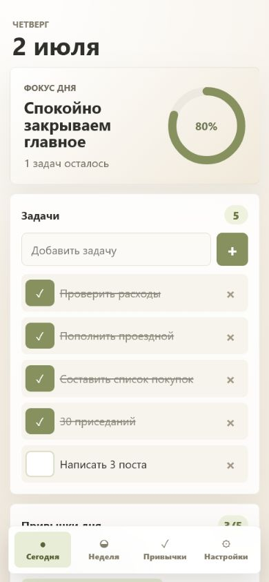
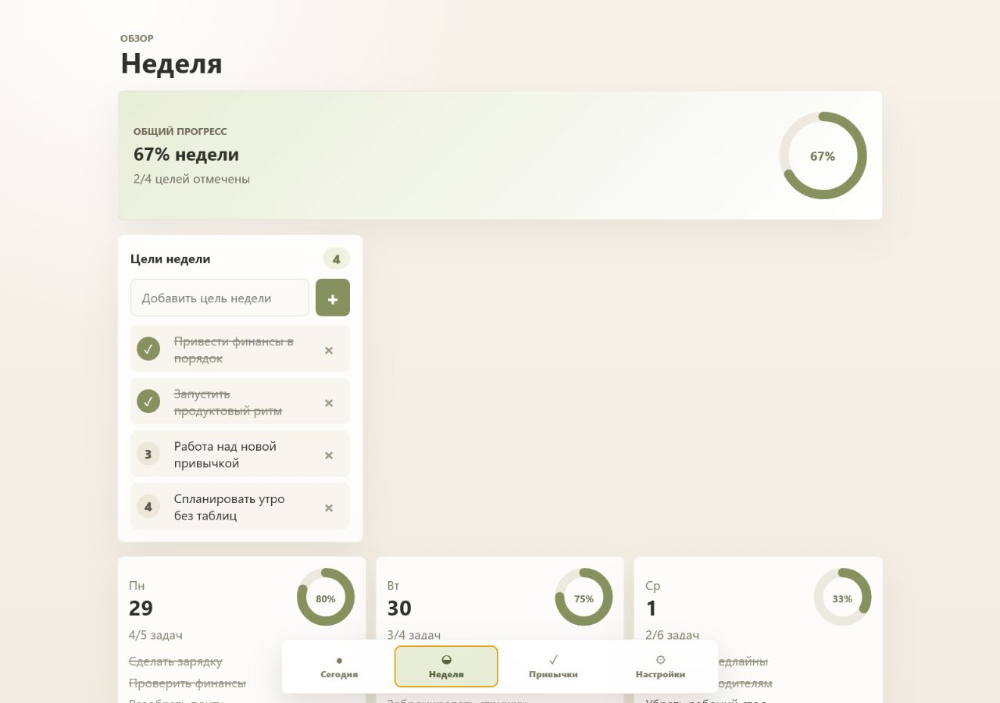

# NotPlanGo

NotPlanGo is a mobile-first weekly planner for people who want a calm, focused alternative to spreadsheet planning.

It brings the week, daily tasks, habits, mood, energy, sleep, and short daily reflection into one installable web app designed for everyday use on a phone.



## What It Helps With

- Plan today without opening a spreadsheet.
- Keep weekly goals visible and measurable.
- Track habits across the week.
- Move unfinished tasks forward without losing context.
- Add tasks for today, tomorrow, or a future date.
- Set task priorities and repeat daily or weekly work.
- Find tasks, goals, and daily notes through search.
- Review unfinished tasks from earlier days before planning ahead.
- Review sleep, energy, mood, and the result of the day.
- Keep personal planning data on the device.

## Main Screens

**Today**

Daily focus, circular progress, tasks, habits, sleep, energy, mood, and a short daily summary.

**Week**

Weekly goals, progress by day, task completion, habit progress, week navigation, and upcoming plans.

**Habits**

A simple weekly habit tracker with large tap targets and clear completion states.

**Settings**

Habit editing, color themes, local reminder controls, storage status, JSON import/export, weekly Markdown export, and local backup restore.

## Mobile-First Experience

NotPlanGo is built around phone use:

- Large tap areas.
- Bottom navigation.
- Floating add button.
- No spreadsheet-style main interface.
- Smooth task and habit interactions.
- Light visual style with multiple calm color themes.



## Privacy And Data

NotPlanGo is local-first.

Your planner data is stored locally in this browser and on this device: the primary copy, an IndexedDB snapshot, and a browser auto-backup. Clearing browser/site data or losing the device can remove all of them. There is no account system, backend database, or server sync in the current version.

For an independent backup that can move between devices, regularly download a JSON export and store it outside the browser. Import replaces the current planner data. Reminders run while the browser or installed PWA is open; reliable background delivery is not part of the current version.

## Backup and Recovery

- **JSON export** is the only portable backup. Keep exported files outside the browser before clearing site data, changing devices, or resetting the app.
- **Restore backup** uses the latest local IndexedDB snapshot and falls back to the browser's emergency auto-backup. Both copies are available only in the same browser on the same device.
- **Import JSON** replaces the current planner state. The app accepts supported planner versions and rejects malformed, oversized, or structurally unsafe files.

## Development

Requires Node.js 22 or newer.

```bash
npm ci
npm run dev
npm test
npm run build
npm run verify:pwa
```

See [architecture](docs/ARCHITECTURE.md), [contributing](CONTRIBUTING.md), [privacy](PRIVACY.md), and the [roadmap](ROADMAP.md) for implementation boundaries and planned work.

## Installable PWA

NotPlanGo can be installed from a supported mobile browser as a Progressive Web App. After the first successful visit, the app shell is available offline through the service worker.

Supported install assets include Android icons, a maskable icon, Apple touch icon, manifest metadata, and mobile screenshots.

## Built For Daily Planning

NotPlanGo focuses on a clear weekly rhythm: plan the day, keep habits visible, review progress, and carry plans forward without returning to a spreadsheet.
